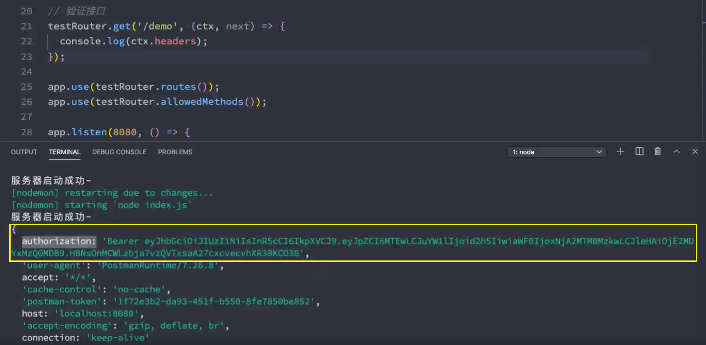

## 1.项目配置

### 在项目主入口文件中创建并启动服务器

- `npm init -y` 生成配置文件

- `npm install koa `基于koa创建app

- `npm install nodemon -D`启动服务器


### 应用配置信息写到环境变量 

- `npm install dotenv`创建并编写**.env**文件。通过**dotenv**加载配置的变量到环境变量里面      

```js
//.env文件
APP_PORT=8000

MYSQL_HOST=localhost
MYSQL_PORT=3306
MYSQL_DATABASE=coderhub
MYSQL_USER=root
MYSQL_PASSWORD=a1234567890
```


## 2. **用户注册接口**

### **1.用户注册接口编写流程**:

- 注册用户路由在router文件中编写     `npm install koa-router `
- 解析客户端传过来的数据    `npm install koa-bodyparser `
- **处理函数的控制器controller文件**编写;   
- 操作数据库的service文件编写

``` sql
CREATE TABLE IF NOT EXISTS `users`(
	id INT PRIMARY KEY AUTO_INCREMENT,
	name VARCHAR(30) NOT NULL UNIQUE,
	password  VARCHAR(50) NOT NULL,
	createAt TIMESTAMP DEFAULT CURRENT_TIMESTAMP,
	updateAt TIMESTAMP DEFAULT CURRENT_TIMESTAMP ON UPDATE CURRENT_TIMESTAMP
);
```


### 2.数据库连接操作:mysql2

- 创建数据库连接;   ` npm install mysql2`
- 测试数据库连接是否成功;

```js
const app = require('./app');
require('./app/database');

const config = require('./app/config');

app.listen(config.APP_PORT, () => {
  console.log(`服务器在${config.APP_PORT}端口启动成功~`);
});
```


### 3.注册用户校验

- 用户名或密码不能为空
- 用户名有没有被注册过

```js
const verifyUser = async (ctx, next) => {
  // 1.获取用户名和密码
  const { name, password } = ctx.request.body;

  // 2.判断用户名或者密码不能空
  if (!name || !password) {
    const error = new Error(errorTypes.NAME_OR_PASSWORD_IS_REQUIRED);
    return ctx.app.emit('error', error, ctx);
  }

  // 3.判断这次注册的用户名是没有被注册过
  const result = await service.getUserByName(name);
  if (result.length) {
    const error = new Error(errorTypes.USER_ALREADY_EXISTS);
    return ctx.app.emit('error', error, ctx);
  }

  await next();
}
```

```js
async getUserByName(name) {
  const statement = `SELECT * FROM users WHERE name = ?;`;
  const result = await connection.execute(statement, [name]);
  // console.log(result);
  // console.log(result[0]);
  return result[0];//如果为空数组，表示没有查询到，没有相同的用户名
}
```


### 4.密码加密存储

```js
const crypto = require('crypto');  //node中自带的加密库
const md5password = (password) => {
  const md5 = crypto.createHash('md5');
  const result = md5.update(password).digest('hex');
  return result;
}

module.exports = md5password;
```


### 5.**错误统一处理**

发射错误处理函数

```js
const error = new Error(errorTypes.NAME_OR_PASSWORD_IS_REQUIRED);
return ctx.app.emit('error', error, ctx);

app.on('error', errorHandler);

const errorTypes = require('../constants/error-types');
const errorHandler = (error, ctx) => {
  let status, message;

  switch (error.message) {
    case errorTypes.NAME_OR_PASSWORD_IS_REQUIRED:
      status = 400; // Bad Request
      message = "用户名或者密码不能为空~";
      break;
    default:
      status = 404;
      message = "NOT FOUND";
  }

  ctx.status = status;
  ctx.body = message;
}

module.exports = errorHandler;

```


## 3.用户登录接口

### 1.用户登录接口编写流程:

- 授权router的编写;
- 处理函数的controller编写;

验证的中间件:

- 账号和密码是否为空; 
- 用户名是否存在;
- 校验密码是否一致;

### 2.判断用户名是否存在、校验密码是否一致

```js
const verifyLogin = async (ctx, next) => {
  console.log("验证登录的middleware~");

  // 1.获取用户名和密码
  const { name, password } = ctx.request.body;

  // 2.判断用户名和密码是否为空
  if (!name || !password) {
    const error = new Error(errorTypes.NAME_OR_PASSWORD_IS_REQUIRED);
    return ctx.app.emit('error', error, ctx);
  }

  // 3.判断用户是否存在的
  const result = await userService.getUserByName(name);
  const user = result[0];
  if (!user) {
    const error = new Error(errorTypes.USER_DOES_NOT_EXISTS);
    return ctx.app.emit('error', error, ctx);
  }

  // 4.判断密码是否和数据库中的密码是一致(加密)
  if (md5password(password) !== user.password) {
    const error = new Error(errorTypes.PASSWORD_IS_INCORRENT);
    return ctx.app.emit('error', error, ctx);
  }

  ctx.user = user;
  await next();
}
```


### 3.动态加载所有的路由

```js
//动态加载所有的路由  src/router/index.js
const fs = require('fs');

const useRoutes = function() {
  fs.readdirSync(__dirname).forEach(file => {
    if (file === 'index.js') return;
    const router = require(`./${file}`);
    this.use(router.routes());
    this.use(router.allowedMethods());
  })
}

module.exports = useRoutes;


// const fs = require('fs');

// const useRoutes = (app) => {
//   fs.readdirSync(__dirname).forEach(file => {  //dirname在这里等于   省略/src/router
//     if (file === 'index.js') return;
//     const router = require(`./${file}`);
//     app.use(router.routes());
//     app.use(router.allowedMethods());
//   })
// }

// module.exports = useRoutes;
-----------------------------------
// src/app/index.js
const Koa = require('koa');
const bodyParser = require('koa-bodyparser');
const errorHandle = require('./error-handle');
const useRoutes = require('../router/index.js');

const app = new Koa();

app.use(bodyParser());

app.useRoutes = useRoutes;
app.useRoutes();
// useRoutes(app);

app.on('UserError', errorHandle);

module.exports = app;
```


### 4.JWT登录凭证;

**token的使用分成两个步骤:**

- **生成token:登录的时候，颁发token;**
- **验证token:访问某些资源或者接口时，验证token;**

**Token的使用,登录成功返回凭证:**

- Token令牌;  **npm install jsonwebtoken**

在**src/app/keys** 文件下。使用openssl来生成一对私钥和公钥

- Mac直接使用terminal终端即可
- Windows默认的cmd终端是不能直接使用的，建议直接使用git bash终端;

```shell
 openssl
> genrsa -out private.key 1024
> rsa -in private.key -pubout -out public.key
```

在**src/app/config文件下导入私钥和公钥** 

fs导入路径使用绝对路径

```js
const dotenv = require('dotenv');
const fs = require('fs');
const path = require('path');

dotenv.config();

const PRIVATE_KEY = fs.readFileSync(path.resolve(__dirname, './keys/private.key'));
const PUBLIC_KEY = fs.readFileSync(path.resolve(__dirname, './keys/public.key'));

// console.log(process.env.APP_PORT);
module.exports = {
  // APP_HOST,
  APP_PORT,
  MYSQL_HOST,
  MYSQL_PORT,
  MYSQL_DATABASE,
  MYSQL_USER,
  MYSQL_PASSWORD,
} = process.env;

module.exports.PRIVATE_KEY = PRIVATE_KEY;
module.exports.PUBLIC_KEY = PUBLIC_KEY;
```


#### 使用公钥和私钥签发和验证签名

```js
// 私钥签发
async login(ctx, next) {
  const { id, name } = ctx.user;
  const token = jwt.sign({ id, name }, PRIVATE_KEY, {
    expiresIn: 60 * 60 * 24,
    algorithm: 'RS256'  // 非对称加密
  });

  ctx.body = { id, name, token }
}

// 公钥验证
const verifyAuth = async (ctx, next) => {
  console.log("验证授权的middleware~");
  // 1.获取token
  const authorization = ctx.headers.authorization;
  if (!authorization) {
    const error = new Error(errorTypes.UNAUTHORIZATION);
    return ctx.app.emit('error', error, ctx);
  }
  const token = authorization.replace('Bearer ', '');

  // 2.验证token(id/name/iat/exp)
  try {
    const result = jwt.verify(token, PUBLIC_KEY, {
      algorithms: ["RS256"]
    });
    ctx.user = result;
    await next();
  } catch (err) {
    const error = new Error(errorTypes.UNAUTHORIZATION);
    ctx.app.emit('error', error, ctx);
  }
}
```


#### 获取和验证token

*ctx*.headers.authorization中获取authorization




#### 客户端获取token和携带token


## 4.发布和修改动态删除内容

### 1.创建新的表 moment

定义发布动态内容的接口

- 定义路由接口
- 验证用户登录
- Controller和Service中处理内容

```js
// {{baseURL}}/moment
momentRouter.post('/', verifyAuth, create);
```

``` sql
CREATE TABLE IF NOT EXISTS `moment`(
	id INT PRIMARY KEY AUTO_INCREMENT,
	content VARCHAR(1000) NOT NULL,
	user_id INT NOT NULL,
	createAt TIMESTAMP DEFAULT CURRENT_TIMESTAMP,
	updateAt TIMESTAMP DEFAULT CURRENT_TIMESTAMP ON UPDATE CURRENT_TIMESTAMP,
	FOREIGN KEY(user_id) REFERENCES user(id)
);
```


### 2.获取单个动态

定义查询单个内容的接口

- 根据momentId查询接口内容; 

```js
// {{baseURL}}/moment/1
momentRouter.get('/:momentId', detail);
// moment.controller.js
async detail(ctx, next) {
  // 获取数据(momentId)
  const momentId = ctx.params.momentId;
  // 根据id去查询这条数据
  const result = await momentService.getMomentById(momentId);

  ctx.body = result;
  // ctx.body = `获取id为${momentId}的动态`;
}
```


### 3.获取动态列表

定义查询多条内容的接口

- 查询所有moment接口内容(根据offset和limit决定查询数量)

```js
// {{baseURL}}/moment?offset=0&size=10
momentRouter.get('/', list);// 获取moment不用授权，因为不登录也可以浏览一些展示的内容
// moment.controller.js
async list(ctx, next) {
  // 获取数据(offset, size)
  const { offset, size } = ctx.query;
  // 根据offset size 去查询数据
  const result = await momentService.getMomentList(offset, size);

  ctx.body = result;
}
```


### 4.修改动态内容

- 定义路由接口

```js
// {{baseURL}}/moment/2
momentRouter.patch('/:momentId',verifyAuth, verifyPermission, update);

async update(ctx, next) {
  // 1.获取参数
  const { momentId } = ctx.params;
  const { content } = ctx.request.body;

  // 2.修改内容
  const result = await momentService.update(content, momentId);
  ctx.body = result;
}
```

- 验证用户登录是否携带token。  src/middleware/auth.middle.js 中的 verifyAuth

- **验证用户的权限**. **verifyPermission**.  
- **这个中间件的作用是为了验证修改动态的时候查看 被修改的动态的id和user_id是否是当前用户所发布的动态**

```js
const verifyPermission = async (ctx, next) => {
  console.log("验证权限的middleware~");

  // 1.获取参数 { commentId: '1' }
  const [resourceKey] = Object.keys(ctx.params);
  const tableName = resourceKey.replace('Id', '');
  const resourceId = ctx.params[resourceKey];
  const { id } = ctx.user;

  // 2.查询是否具备权限
  try {
    const isPermission = await authService.checkResource(tableName, resourceId, id);
    if (!isPermission) throw new Error();
    await next();
  } catch (err) {
    const error = new Error(errorTypes.UNPERMISSION);
    return ctx.app.emit('error', error, ctx);
  }
}
```

- Controller和Service中的处理

```js
const connection = require('../app/database');

class AuthService {
  async checkResource(tableName, id, userId) {
    const statement = `SELECT * FROM ${tableName} WHERE id = ? AND user_id = ?;`;
    const [result] = await connection.execute(statement, [id, userId]);
    return result.length === 0 ? false: true;
  }
}

module.exports = new AuthService();
```


### 5.删除动态内容

定义删除内容的接口

- 定义路由接口
- 验证用户登录
- 验证用户权限
- Controller和Service的处理 

```js
momentRouter.delete('/:momentId', verifyAuth, verifyPermission, remove);
//moment.controller.js
async remove(ctx, next) {
  // 1.获取momentId
  const { momentId } = ctx.params;
  // console.log(momentId);
  // 2.删除内容
  const result = await momentService.removeMoment(momentId);
  // console.log(result);
  ctx.body = result;
}
//moment.service.js
async removeMoment(momentId) {
  const statement = `DELETE FROM moment WHERE id = ?`;
  console.log(statement);
  const [result] = await connections.execute(statement, [momentId]);
  return result;
}
```


## 5.发表和修改删除查询评论

- 定义路由接口
- 验证用户登录
- Controller和Service中处理内容

``` sql
CREATE TABLE IF NOT EXISTS `comment`(
	id INT PRIMARY KEY AUTO_INCREMENT,
	content VARCHAR(1000) NOT NULL,
	moment_id INT NOT NULL,
  user_id INT NOT NULL,
	comment_id INT DEFAULT NULL,
	createAt TIMESTAMP DEFAULT CURRENT_TIMESTAMP,
	updateAt TIMESTAMP DEFAULT CURRENT_TIMESTAMP ON UPDATE CURRENT_TIMESTAMP,
	
	FOREIGN KEY(moment_id) REFERENCES moment(id) ON DELETE CASCADE ON UPDATE CASCADE,
	FOREIGN KEY(user_id) REFERENCES user(id) ON DELETE CASCADE ON UPDATE CASCADE,
	FOREIGN KEY(comment_id) REFERENCES comment(id) ON DELETE CASCADE ON UPDATE CASCADE
);
```


### 1.发表评论

```js
commentRouter.post('/', verifyAuth, create);

async create(ctx, next) {
  const { momentId, content } = ctx.request.body;
  const { id } = ctx.user;
  const result = await service.create(momentId, content, id);
  ctx.body = result;
}

async create(momentId, content, userId) {
  const statement = `INSERT INTO comment (content, moment_id, user_id) VALUES (?, ?, ?);`;
  `INSERT INTO comment SET ?`
  const [result] = await connection.execute(statement, [content, momentId, userId]);
  return result;
}
```


### 2.回复评论

```js
commentRouter.post('/:commentId/reply', verifyAuth, reply);

async reply(ctx, next) {
  const { momentId, content } = ctx.request.body;
  const { commentId } = ctx.params;
  const { id } = ctx.user;
  const result = await service.reply(momentId, content, id, commentId);
  ctx.body = result;
}

async reply(momentId, content, userId, commentId) {
  const statement = `INSERT INTO comment (content, moment_id, user_id, comment_id) VALUES (?, ?, ?, ?);`;
  const [result] = await connection.execute(statement, [content, momentId, userId, commentId]);
  return result;
}
```


### 3.定义修改评论内容的接口

- 定义路由接口
- 验证用户登录
- 验证用户的权限
- Controller和Service中的处理


```js
commentRouter.patch('/:commentId', verifyAuth, verifyPermission, update);

async update(ctx, next) {
  const { commentId } = ctx.params;
  const { content } = ctx.request.body;
  const result = await service.update(commentId, content);
  ctx.body = result;
}

async update(commentId, content) {
  const statement = `UPDATE comment SET content = ? WHERE id = ?`;
  const [result] = await connection.execute(statement, [content, commentId]);
  return result;
}
```


### 4.定义删除评论内容的接口

- 定义路由接口
- 验证用户登录
- 验证用户权限
- Controller和Service的处理

```js
commentRouter.delete('/:commentId', verifyAuth, verifyPermission, remove);

async remove(ctx, next) {
  const { commentId } = ctx.params;
  const result = await service.remove(commentId);
  ctx.body = result;
}

async remove(commentId) {
  const statement = `DELETE FROM comment WHERE id = ?`;
  const [result] = await connection.execute(statement, [commentId]);
  return result;
}
```


### 5.评论列表

- 查询多个动态时，显示评论的个数
- 查询单个动态时，显示评论的列表

```js
commentRouter.get('/', list);

async list(ctx, next) {
  const { momentId } = ctx.query;
  const result = await service.getCommentsByMomentId(momentId);
  ctx.body = result;
}

async getCommentsByMomentId(momentId) {
  const statement = `
    SELECT 
      m.id, m.content, m.comment_id commendId, m.createAt createTime,
      JSON_OBJECT('id', u.id, 'name', u.name) user
    FROM comment m
    LEFT JOIN user u ON u.id = m.user_id
    WHERE moment_id = ?;
  `;
  const [result] = await connection.execute(statement, [momentId]);
  return result;
}
```


## 6.标签接口开发


创建标签的表

定义创建标签接口

- 路由配置Router
- 验证用户登录
- 创建标签

创建标签和动态关系表

```
定义接口:

作用：给动态添加标签

请求：POST

接口：moment/1/labels

参数：labels

例子：body { labels: ["前端"] }
```

定义给动态添加标签的接口

- 给动态添加新的接口

查询标签接口

- 查询动态列表，展示标签数量
- 查询动态详情，展示标签列表


## 7.上传头像图片

上传头像逻辑

- 定义上传图像的接口
- 定义获取图像的接口
- 请求用户信息时，获取头像

上课分析实现思路:

1.图片(文件)上传 /upload/avatar

​	目的:服务器端可以保存一张图片

2.提供一个接口，可以让用户获取图片

​	/1/avatar -> 找到图片\读取图片\content-type: image/jpeg\返回图像的信息

3.将URL存储到用户信息中

​	avatarURL: 头像的地址

4.获取信息时，获取用户的头像


**上传动态的配图**

上传动态配图

- 定义上传动态配图的接口
- 定义获取动态配图的接口
- 获取动态时，获取配图信息


